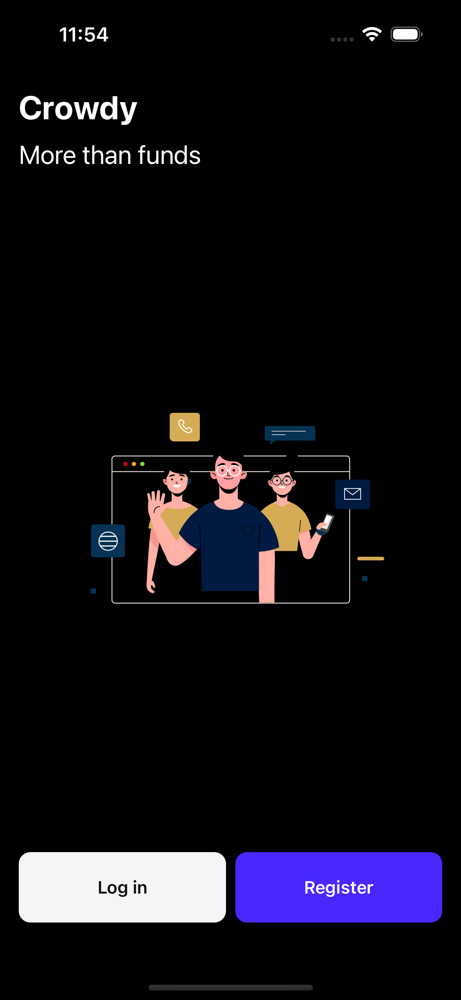

# Crowdy - Dimploma Project in Financial University under the Government of the Russian Federation.

## About
<b>Crowdy</b> - application which provide opportunity to organize, take part in or just collect funds.

## Architecture
Application created with SwiftUI and module architecture (using SPM). All modules implement TCA framework structure. Navigation between modules created by coordinator pattern.
## Stack
1. SwiftUI
2. Lottie
3. Combine
4. TCA
